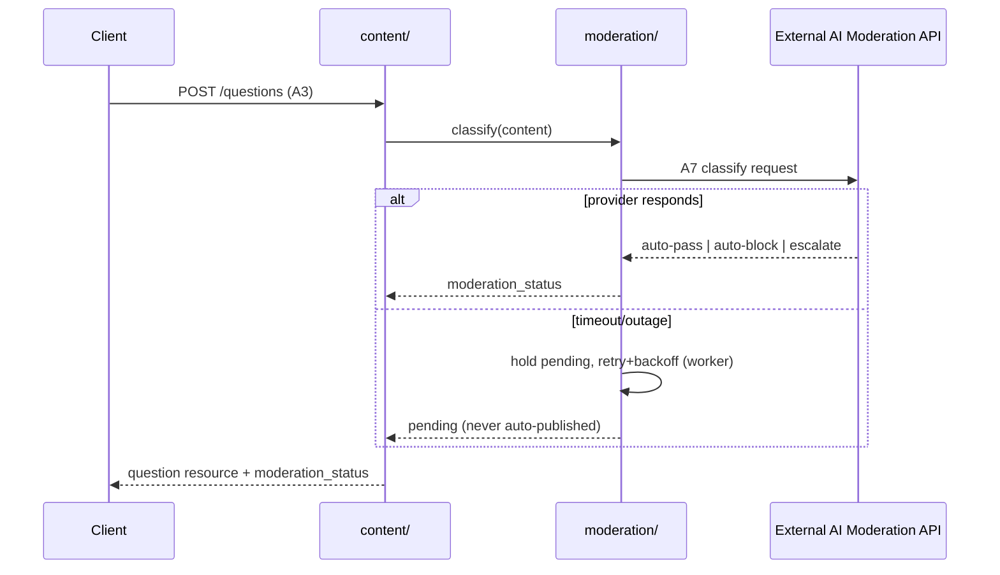
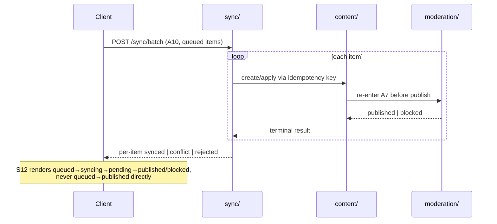
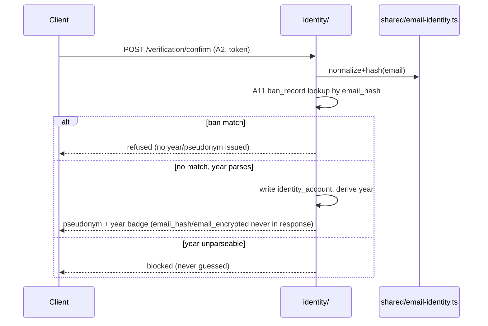

# Build Architecture: Murmur (Verified Anonymous Campus Q&A)

**Date:** 2026-07-19
**Inherits:** `docs/03-trd.md` (modular monolith, 11 components, A1–A12), `docs/05-schema.md` (14
Postgres tables), `docs/07-plan.md` (48 tasks, M1–M6). This document does not re-decide anything —
it is the code-level bridge between the TRD's system architecture and the plan's task sequence,
answering "what file/folder does each TRD component become, and what does it own."

**Scope boundary (stage-6 human decision, carried into the plan's `deviations[0]`):** this document
governs server, worker, data, and integration-shell structure only. Visual component code lives in
`client/src/components/` and is authored exclusively by Claude Design; nothing here specifies
markup, styling, or component internals — only the props/contracts components are wired to.

> **Provenance discipline**, same as upstream stages: every module, route, and job below traces to
> a TRD component/API, a schema table, or a plan task. Anything not directly named upstream is
> tagged `[ASSUMPTION]`.

---

## 1. Repo layout

```
/
├── server/
│   ├── src/
│   │   ├── modules/                  # one folder per TRD §4 component (see §2)
│   │   │   ├── identity/
│   │   │   ├── profile/
│   │   │   ├── content/
│   │   │   ├── search/
│   │   │   ├── reputation/
│   │   │   ├── moderation/
│   │   │   ├── grievance/
│   │   │   ├── sync/
│   │   │   ├── analytics/
│   │   │   └── notification/
│   │   ├── worker/                   # background jobs (§5)
│   │   │   ├── moderation-retry.job.ts
│   │   │   ├── grievance-sla.job.ts
│   │   │   └── sync-reconciliation.job.ts
│   │   ├── shared/                   # cross-cutting, no module owns these (§4)
│   │   │   ├── email-identity.ts
│   │   │   ├── idempotency.ts
│   │   │   ├── session.ts
│   │   │   ├── operator-authz.ts
│   │   │   ├── rate-limit.ts
│   │   │   └── error-envelope.ts
│   │   └── app.ts                    # route registration, module wiring
│   ├── migrations/                   # 001–006 per plan §4 (T4/T13/T21/T27/T33/T44)
│   └── config/                       # campus-domain allowlist, provider keys, HMAC pepper ref
├── client/                           # PWA shell (routing, state, service worker)
│   ├── src/
│   │   ├── components/               # Claude Design output lands here verbatim — Claude Code
│   │   │                             # never authors files in this folder (T9/T18/T25/T30/T39)
│   │   ├── screens/                  # S1–S17 composition + state-machine wiring (T10/T19/T26/T31/T40/T41)
│   │   └── mock-data.js              # retained per T1 as integration-test fixture data
├── tests/
│   ├── unit/
│   ├── integration/                  # per-module, hits a real test Postgres (T3)
│   └── nfr/                          # criterion-ID-named NFR suite (T55-T59, T47 regression) — see §8
├── .ci/                              # lint/typecheck/test/migration-check + Layer-1 quality gates (T3) — see §8
└── runbooks/                         # 4 human-authored ops runbooks, existence-gated at launch (T72-T75) — see §8
    ├── pepper-rotation.md
    ├── moderation-provider-outage.md
    ├── takedown-sla-breach.md
    └── dpdp-breach-notification.md
```

`src/ui/app.css` is deleted (superseded); `src/ui/mock-data.js` moves to `client/src/mock-data.js`
as fixture data — both per plan T1.

---

## 2. Module map

TRD §4's 11 components, each as a concrete `server/src/modules/*` folder. "Owned tables" = tables
this module reads/writes directly; every other module reaches those tables only through this
module's exported functions, never with a direct query — this is what keeps the monolith modular.

| Module folder | TRD component | Owned tables (docs/05-schema.md) | Allowed to call |
|---|---|---|---|
| `identity/` | Identity & Verification Service | `identity_account`, `ban_record` | `profile/`, `notification/` |
| `profile/` | Pseudonymous Profile Manager | `pseudonymous_profile` | `identity/` (internal link only) |
| `content/` | Content Service (Q&A Core) | `question`, `answer`, `topic_tag`, `content_draft` | `moderation/`, `search/` (publish-event), `sync/`, `analytics/` |
| `search/` | Search & Browse Index | *(none — reads `content`'s `search_vector` columns; no separate index table)* | `content/` (read-only) |
| `reputation/` | Reputation Engine | `reputation_event` | `content/`, `identity/` (ban propagation), `moderation/` |
| `moderation/` | Moderation Gateway | `moderation_case` | `content/`, External AI Moderation API (§6 integration), `grievance/` (escalation handoff) |
| `moderation/` *(escalation sub-path)* | Human Escalation Queue | *(shares `moderation_case`, filters `risk_tier = 'escalate'`)* | `moderation/`, `grievance/` |
| `grievance/` | Grievance & Takedown Service | `grievance_report`, `grievance_audit_log`, `grievance_officer_contact` | `content/` (takedown status write), `notification/` |
| `sync/` | Offline Sync Manager | `sync_queue_item` | `content/`, `reputation/`, `grievance/`, `moderation/` (re-entry) |
| `analytics/` | Analytics Instrumentation Service | `analytics_event` | *(none — write-only sink; every module emits into it, fire-and-forget)* |
| `notification/` | Notification Dispatcher | *(none — stateless dispatch)* | Email/OTP Delivery Provider (§6 integration) |

`Human Escalation Queue` is not a separate folder: TRD §4 defines it as an operator-facing view over
the Moderation Gateway's own data (ambiguous/escalated `moderation_case` rows), not a component with
tables of its own — so it lives inside `moderation/` as an escalation query + the T36 operator-decide
handler.

---

## 3. API route → module → plan task map

All of A1–A12 plus the T36 operator-decide contract (not yet named by the TRD; route below is
`[ASSUMPTION]` naming, pending T36's own definition). Auth levels: **public** (pre-verification),
**session** (verified student, per T12), **operator** (T37 role gate), **internal** (never exposed
as an HTTP route — called module-to-module only).

| Route | Module | Auth | Plan task | Notes |
|---|---|---|---|---|
| `POST /verification/initiate` (A1) | `identity/` | public | T7 | domain allowlist, dup/malformed refusal, rate-limited |
| `POST /verification/confirm` (A2) | `identity/` | public | T8 | calls A11 + year-derivation ruleset (T6) internally |
| *(internal)* Ban Enforcement Check (A11) | `identity/` | internal | T23 | invoked only from A2 |
| `POST /questions` (A3) | `content/` | session | T15 | idempotency, topic validation, ban guard, calls A7 |
| `POST /questions/{id}/answers` (A4) | `content/` | session | T16 | same shape as A3 |
| `GET /questions/search` (A5) | `search/` | session | T17 (browse), T20 (full search) | keyword/topic/cohort, empty-state payload |
| `POST /answers/{id}/vote`, `/accept` (A6) | `reputation/` | session | T22 | self-vote/duplicate/banned guards |
| *(internal)* Moderation Classify (A7) | `moderation/` | internal | T14 | called by `content/` (A3/A4) and `sync/` (A10 re-entry) |
| `POST /reports` (A8) | `grievance/` | session (supports anonymous flag) | T34 | SLA-deadline computation, dup-merge |
| `POST /reports/{id}/resolve` (A9) | `grievance/` | **operator** | T35 | guarded by `shared/operator-authz.ts` |
| `POST /sync/batch` (A10) | `sync/` | session | T29 | per-item terminal result; routes back through A7 |
| `POST /events` (A12) | `analytics/` | public + session | T44 | fire-and-forget, never blocks caller |
| `POST /moderation-cases/{id}/decide` *(T36, new)* | `moderation/` | **operator** | T36 | closes OQ-11; guarded by `operator-authz.ts` |

---

## 4. Cross-cutting concerns (`server/src/shared/`)

The layer the TRD deliberately left unspecified (system-level HOW, not code-level HOW) but that
every module needs identically — built once, imported everywhere, never duplicated per-module.

- **`email-identity.ts`** — the single normalization + keyed-HMAC procedure (lowercase, strip
  known campus-domain aliasing, HMAC with a server-held pepper) used by A1's duplicate-email check,
  A2's identity_account write, and A11's ban_record lookup. `identity_account.email_hash` and
  `ban_record.email_hash` **must** be produced by this one function — schema §6 and TRD risk
  "email-hash matching" both name normalization drift as the exact failure mode this utility exists
  to prevent. Pepper management/rotation strategy (schema open question, plan RR-13) is documented
  alongside this file, not improvised per call site.
- **`idempotency.ts`** — shared middleware for A3/A4/A6/A10, all of which accept a
  client-generated idempotency key and must replay, not duplicate, on retry.
- **`session.ts`** — session token issuance/validation for the authenticated shell behind S5–S17
  (plan T12, resolves UX OQ-14).
- **`operator-authz.ts`** — role check gating A9 and the T36 decide route (plan T37); non-operator
  callers get a uniform `forbidden` response.
- **`rate-limit.ts`** — shared limiter for A1 (verification abuse) and A8 (report abuse).
- **`error-envelope.ts`** — one response shape for every module's error branches, so the 17 UX
  screens' error states (sourced from `apis[].errors` per TRD §6) render consistently regardless of
  which module produced the failure.

---

## 5. Background worker (`server/src/worker/`)

| Job | Reads/writes | Triggers | Plan task | Failure posture |
|---|---|---|---|---|
| `moderation-retry.job.ts` | `moderation_case` (via `moderation/`) | On A7 timeout/outage | T14 | Fail-closed: retry w/ backoff, auto-escalate past threshold — never publish, never drop (TRD §8) |
| `grievance-sla.job.ts` | `grievance_report.sla_deadline` (via `grievance/`) | Scheduled tick | T38 | Acknowledgement + resolution SLA timers; fires operator alerts via `notification/` |
| `sync-reconciliation.job.ts` | `sync_queue_item` (via `sync/`) | Scheduled tick | T32 | Alerts if any item sits non-terminal past a bounded window (offline sync reliability NFR) |

---

## 6. Key data flows

**(a) UGC publish through the fail-closed moderation gate**



**(b) Offline queue → sync → moderation re-entry → truthful S12 state chain**



**(c) Registration: hash/ban-check path, raw email never crosses the response boundary**



---

## 7. Milestone → architecture increment map

What exists in the codebase at the end of each plan milestone — engineering scope only (Claude
Design rounds T9/T18/T25/T30/T39 are the human-mediated exception, tracked in the plan itself, not
repeated here).

| Milestone | Modules live | Routes live | Worker jobs live | Migrations applied | Shared/infra new this milestone |
|---|---|---|---|---|---|
| **M1** | `identity/`, `profile/` (partial), `analytics/` (moved up — plan revision 2026-07-19) | A1, A2 (+ A11 internal), A12 | — | 001, 006 | `shared/email-identity.ts` (T50); staging deployment (T49); vendor-shortlist spike (T54, parallel, no code) |
| **M2** | + `content/`, `moderation/`, session (`shared/session.ts`) | + A3, A4, A5 (browse only) | + moderation-retry | 002 | — |
| **M3** | + `reputation/`, `search/` (full) | + A5 (full search), A6 | — | 003 | — |
| **M4** | + `sync/` | + A10 | + sync-reconciliation | 004 | — |
| **M5** | + `grievance/`, `notification/` (full), `operator-authz.ts` | + A8, A9, T36 decide route | + grievance-sla | 005 | — |
| **M6** | *(no new modules — analytics landed at M1)* | *(no new routes)* | — | — | — |

**Note (2026-07-19 revision):** migration 006 (`analytics_event`) and route A12 were originally
scoped to M6 in the first version of `docs/07-plan.md`; the plan revision moved them to M1 (plan
tasks T44/T45) so metric history accumulates from the tracer instead of starting a 30-day D30
clock at launch. `shared/email-identity.ts` — described in §4 as a cross-cutting utility — is
built at M1 (plan task T50), not invented ad hoc at M3 as an earlier plan draft had it; A1/A2/A11
all depend on it existing from day one.

---

## 8. Quality-gate cadence (quality-kit stages 08–16)

**Source of truth:** `quality-kit-additions/cadence.md` (DECISION QK-4) — this section only maps
that cadence onto the module/route architecture above so an engineer touching a given module
knows which gate fires. It does not restate the full cadence doctrine.

- **Layer 1 (continuous, every push):** wired into `.ci/` at plan task T3 — gitleaks (secrets,
  blocking from first run), semgrep (SAST), osv-scanner (SCA per lockfile), and the
  test-writer→test-verifier loop. No module-specific config; applies to the whole `server/` tree.
- **Layer 2 (milestone gates):** security-agent, resilience-agent, perf-agent, observability-agent,
  privacy-agent, and (once, at M6) production-test-agent each run their full skill against the
  codebase as it stands at that milestone's exit — see plan tasks T60–T71, T76. Findings land in
  `docs/08-security.md` … `docs/16-privacy.md` as dated incremental sections, finalized at M6.
- **Layer 3 (event triggers):** scoped re-checks fire on specific task types regardless of
  milestone — most relevant to this architecture doc:
  - Any change to `server/src/shared/*` (T50 email-identity, T12 session, T37 operator-authz,
    rate-limit) triggers a security manual-check of that file **and every module importing it**,
    per §4's cross-cutting design — one bug in `shared/` is a bug everywhere.
  - A new migration (001–006, plan T4/T13/T21/T27/T33/T44) triggers a perf EXPLAIN pass + a
    security storage-rules check (no table readable/writable outside its owning module, per §2's
    module-ownership table).
  - A migration adding a PII-classified column (T4's `identity_account`/`email_encrypted`, T33's
    `grievance_report`) triggers a privacy-agent inventory update + leakage re-sweep — the
    PII-owning modules are exactly `identity/` and `grievance/` in §2's module map.
  - A new external integration (T5 Email/OTP, T14 AI Moderation) triggers security + resilience
    checks on that integration's credential handling and fail-posture (§6 flows already document
    the fail-closed path T14 must satisfy).
  - A backup/provider config change to the **T49 staging deployment** triggers a restore drill
    (resilience-audit step 6, QK-8) — restores are exercised only against T49's staging DB, never
    production.
- **Runbooks & restore drill (QK-8):** the four `runbooks/` files (repo root, see §1) are
  human-authored and existence-gated, not code — the architecture here only needs to guarantee
  their preconditions are satisfiable: `shared/email-identity.ts` (T50) must support versioned
  peppers before the pepper-rotation runbook's dual-hash step is executable.
- **PII-owning modules (privacy-agent, stage 16):** per §2, `identity/` owns `identity_account`
  (email_hash, email_encrypted) and `ban_record`; `grievance/` owns `grievance_report` (reporter
  reference, is_anonymous); `analytics/` owns cohort-derivation references. Privacy-agent's PII
  inventory (docs/16-privacy.md) is built directly from this ownership map plus `docs/05-schema.md`
  — no PII field exists outside a module that already appears in §2.

## 9. Boundary note

Everything above governs code *behind* component props: routes, modules, tables, jobs, shared
utilities. It does not specify markup, styling, layout, or any visual component internals — those
are Claude Design's exclusive output per the stage-6 human decision, landed untouched in
`client/src/components/` and only *integrated* (never authored or restyled) by the tasks in
`docs/07-plan.md` §4.
